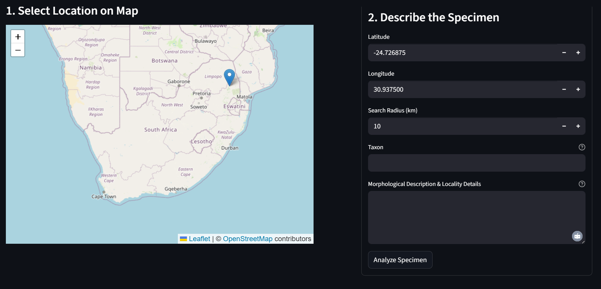

# Botanical Identification Assistant for Southern African Flora

[](https://sa-flora-id.streamlit.app)

This tool is an AI-powered web application for botanists and plant enthusiasts working with Southern African flora. It automates the process of identifying a plant specimen by comparing user-provided details against a hyper-local list of potential species.

## 🚀 Try the Live Application!

The easiest way to use the tool is through the public web application. No installation is required.

**[https://sa-flora-id.streamlit.app](https://sa-flora-id.streamlit.app)**

---

### App Preview


---

## ✨ Features

-   **Intuitive Web Interface:** A clean, simple user interface that runs in any web browser.
-   **Interactive Map:** Select your collection site visually by clicking on a map of Southern Africa.
-   **Hyper-local Species Lists:** Queries the Global Biodiversity Information Facility (GBIF) for a checklist of potential species recorded at your specific location.
-   **Prioritized South African Data:** Scrapes detailed morphological descriptions, prioritizing the high-quality data from the **e-Flora of South Africa (SANBI)**, with **Plants of the World Online (POWO)** as a fallback.
-   **AI-Powered Taxonomic Analysis:** Uses Google's Gemini model to perform a reasoned, comparative analysis of your specimen against the scraped descriptions.
-   **Detailed Reporting:** Generates a comprehensive HTML report with the full analysis for your records.

## 🛠️ How It Works

The tool follows a simple three-step data pipeline:
1.  **Checklist Generation:** It uses your selected coordinates and taxon to query the GBIF database for a list of species.
2.  **Data Aggregation:** It visits the e-Flora SA and POWO websites to scrape relevant botanical descriptions for each species.
3.  **AI Synthesis:** It sends the aggregated descriptions and your specimen notes to the Gemini AI model, which performs the final analysis and identification.

## 💻 For Developers: Running Locally

If you want to run the application on your own machine or contribute to its development, follow these steps.

### Prerequisites

-   Python 3.8 or newer.
-   A Google API Key for the Gemini model. You can get one from [Google AI Studio](https://aistudio.google.com/app/apikey).

### Step-by-Step Guide

1.  **Clone the Repository:**
    ```bash
    git clone https://github.com/gouania/sa-flora-tool.git
    cd sa-flora-tool
    ```

2.  **Install Dependencies:**
    This will install all necessary Python libraries from the `requirements.txt` file.
    ```bash
    # For Windows
    py -m pip install -r requirements.txt

    # For macOS/Linux
    python3 -m pip install -r requirements.txt
    ```

3.  **Set Your API Key:**
    The recommended way to handle your API key locally is with an environment variable.
    -   **On Windows (in Command Prompt):**
        ```cmd
        setx GOOGLE_API_KEY "PASTE_YOUR_API_KEY_HERE"
        ```
    -   **On macOS/Linux (add to `~/.zshrc` or `~/.bash_profile`):**
        ```bash
        export GOOGLE_API_KEY="PASTE_YOUR_API_KEY_HERE"
        ```
    **Important:** You must close and re-open your terminal/VS Code for this change to take effect.

4.  **Run the Streamlit App:**
    ```bash
    # For Windows
    py -m streamlit run app.py

    # For macOS/Linux
    streamlit run app.py
    ```

## 🔮 Future Development

-   [ ] Integrate image analysis capabilities using a multimodal AI model.
-   [ ] Add user accounts to save and manage identification history.
-   [ ] Expand data sources to include other relevant regional floras.

## 📄 License

This project is licensed under the MIT License.